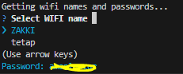
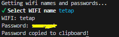

Give a list of saved WIFI name and password in **_your own_** computer (WIFI that was connected previously).

#### To Do

- [ ] Linux? and MacOS support
- [ ] CommonJS module?

## Usage

### CLI 

- Install globally with `npm` or `yarn` or etc.
  
  ```cmd
  npm install -g saved-wifi-list
  ```
  
- Run command

  ```bash
  saved-wifi-list
  ```

> or run without install `npx saved-wifi-list`

- Choose WIFI name with up/down arrow keys, or search by typing (case-insensitive)

  

- Password are shown for every highlighted choice. Or after selection. And will be copied to clipboard

  

### API

- Install in your project with `npm` or `yarn` or etc.
  
  ```cmd
  npm install saved-wifi-list
  ```

- import in your js file, it will return an array of object.

  returned data : 
  ```javascript
  [
    {
      name: "",
      password: "",
    },
    //...
  ]
  ```
  
  example code:

  ```javascript
  // import at the top
  import savedWifiList from "saved-wifi-list";

  // somewhere in your code
  // with async...await
  try {
    // ...
    const savedWifi = await savedWifiList();
    console.log(savedWifi); // [ { name: "your wifi name", password: "your wifi password", }, ... ]
    // ...

  } catch (err) {
    // handle error
  }

  // with .then
  savedWifiList().then((savedWifi)=>{
    // do something 
  }).catch((err)=>{
    // handle error
  })
  
  ```

## Credits

Code based on [wifi-name](https://github.com/kevva/wifi-name) and [wifi-password](https://github.com/kevva/wifi-password)

## LICENSE

MIT License